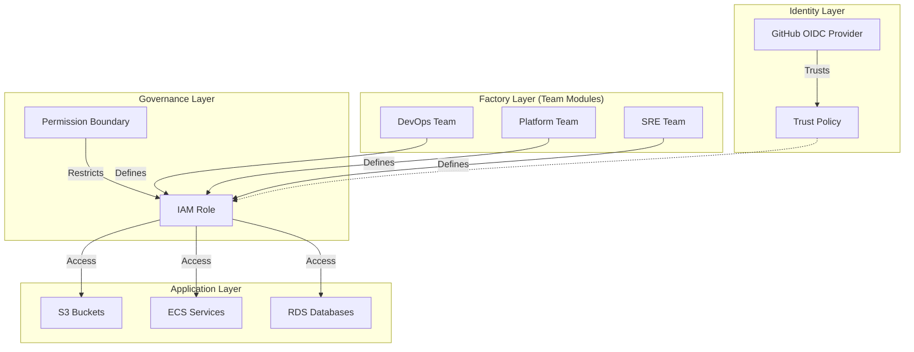

# tf-aws-iam-enterprise


**Enterprise-grade IAM framework: OIDC federation, least privilege by design, compliance-native.**

---

## 🎯 The Mission

Managing IAM in AWS is often a chaotic mess of long-lived access keys, over-privileged users, and "ClickOps" drift. **tf-aws-iam-enterprise** solves this by providing a standardized, secure, and automated factory for identity.

### 🛑 The Problem
- **Key Sprawl:** Long-lived Access Keys leaking into logs and git repos.
- **Role Explosion:** "One-off" roles created manually without tagging or boundaries.
- **Compliance Nightmares:** Auditors asking "who can do what?" with no clear answer.

### ✅ The Solution
- **OIDC First:** Zero long-lived credentials. GitHub Actions assume roles via OpenID Connect.
- **Factory Pattern:** Standardized `app-role-generator` ensures every role has boundaries and tags.
- **Team Governance:** Roles are namespaced by team (`devops`, `platform`, `sre`), preventing ownership drift.

---

## 🏗️ Architecture

This repository is organized into layers, ensuring a separation of concerns between infrastructure, identity, and application teams.



---

## 🚀 Quick Start

Get a secure, OIDC-backed IAM role running in **5 minutes**.

### 1. Initialize the Provider
First, set up the GitHub OIDC provider. This only needs to be done once per account.

```hcl
module "github_oidc" {
  source = "./modules/github-oidc"
  tags   = { Environment = "Production" }
}
```

### 2. Create a Role
Use the `app-role-generator` to create a secure role for your application.

```hcl
module "my_app_role" {
  source = "./modules/app-role-generator"

  role_name   = "my-team-cool-app"
  description = "Role for the Cool App deployment pipeline"
  app_name    = "cool-app"
  team        = "my-team"

  # Identity
  oidc_provider_arn   = module.github_oidc.provider_arn
  github_repositories = ["my-org/cool-app"]

  # Guardrails
  permissions_boundary_arn = "arn:aws:iam::123456789012:policy/boundary/PowerUserBoundary"

  # Permissions (Inline or Managed)
  inline_policy = data.aws_iam_policy_document.cool_app_permissions.json
}
```

### 3. Use it in GitHub Actions
```yaml
permissions:
  id-token: write
  contents: read

jobs:
  deploy:
    runs-on: ubuntu-latest
    steps:
      - name: Configure AWS Credentials
        uses: aws-actions/configure-aws-credentials@v2
        with:
          role-to-assume: arn:aws:iam::123456789012:role/my-team-cool-app
          aws-region: us-east-1
```

---

## 📂 Repository Structure

```
tf-aws-iam-enterprise/
├── modules/
│   ├── foundation/             # Base security (CloudTrail, Password Policy, Alarms)
│   ├── github-oidc/            # The OIDC Identity Provider
│   ├── app-role-generator/     # The "Factory" for creating secure roles
│   ├── teams/                  # Team-specific role registries
│   │   ├── devops/             # Roles for Backend/Frontend deployments
│   │   ├── platform/           # Roles for Infrastructure/Network admin
│   │   ├── sre/                # Roles for Reliability engineering
│   │   └── security/           # Roles for Audit/GuardDuty
│   └── identity-center/        # AWS SSO (Identity Center) Configuration
├── policies/
│   └── opa-conftest/           # Rego policies for OPA validation
├── .github/workflows/          # CI/CD pipelines
└── examples/                   # Reference implementations
```

---

## 🛡️ Compliance & Security

This library is built to satisfy strict security requirements out of the box.

| Requirement | Implementation |
|-------------|----------------|
| **No Long-Lived Keys** | All CI/CD access is via **OIDC** short-lived tokens. |
| **Least Privilege** | Roles are scoped to specific repos and paths. |
| **Boundaries** | Every role supports a **Permissions Boundary** to prevent escalation. |
| **Auditing** | CloudTrail and CloudWatch Alarms are configured in `modules/foundation`. |
| **Validation** | OPA and Checkov run on every PR to enforce standards. |

---

## 📄 License

This project is licensed under the MIT License - see the [LICENSE](LICENSE) file for details.
